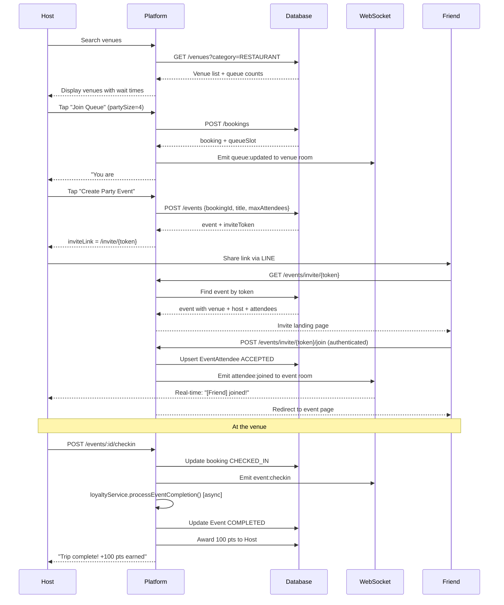

# User Journey & Flow

## Mermaid Diagram

## Step-by-Step Breakdown

### Phase 1: Discovery
1. User opens app, sees list of venues with real-time queue count
2. Can filter by category (RESTAURANT, BAR, CAFE, etc.)
3. Taps a venue → sees tables available, avg wait time, live queue depth

### Phase 2: Booking
4. Taps **Join Queue** or **Reserve Ahead**
5. Selects party size (1–20 people)
6. System creates `Booking` + `QueueSlot`, returns queue number
7. All connected clients on `venue:{id}` room receive `queue:updated`

### Phase 3: Social Event Creation
8. Host taps **Create Party Event**
9. Enters event name + optional description + max friends
10. System creates `Event` with a unique `inviteToken` (UUID)
11. Returns shareable `inviteLink` = `{FRONTEND_URL}/invite/{token}`
12. Host copies link or taps **Share via LINE**

### Phase 4: Friend Joins
13. Friend opens invite link (no account needed to VIEW)
14. Sees venue photo, host name, queue position, friends already joined
15. Taps **Join the Party!** → if not logged in, redirected to login/register
16. System creates `EventAttendee` with status `ACCEPTED`
17. WebSocket broadcasts `attendee:joined` to host's screen instantly
18. Friend sees live queue countdown alongside host

### Phase 5: Check-in & Loyalty
19. Venue staff calls queue number → system sends push notification
20. Host arrives, taps **Check In**
21. System marks booking `CHECKED_IN` and evaluates success:
    - ≥ 80% of accepted attendees must check in
    - Host account must be ≥ 7 days old
22. If successful: Event marked `COMPLETED`, 100 pts awarded to Host
23. If milestone reached (e.g., trip #10): bonus 1,000 pts + GOLD tier unlocked
